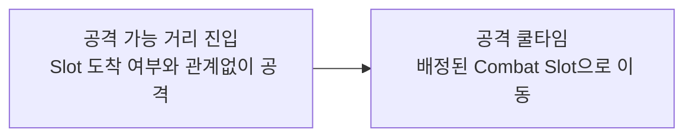
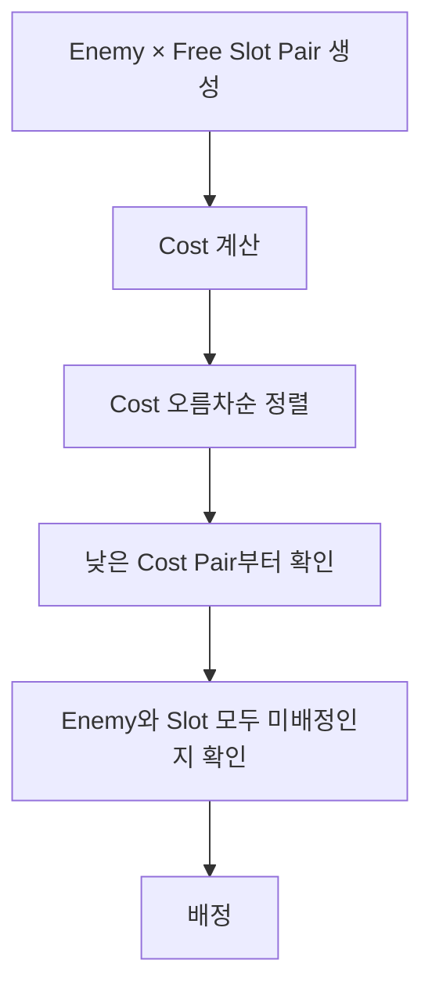

# Combat Slot System

> 다수의 적이 한쪽에 몰리지 않고 플레이어 주변에 자연스럽게 분산되도록,
> 적의 위치와 방향을 고려해 가까운 전투 위치를 배정하는 Combat Slot 시스템

---

## 목차

- [설계 배경](#설계-배경)
- [구조 다이어그램](#구조-다이어그램)
- [핵심 구현](#핵심-구현)
  - [1. 플레이어 주변 Combat Slot 구성](#1-플레이어-주변-combat-slot-구성)
  - [2. Enemy-Slot 배정 기준](#2-enemy-slot-배정-기준)
  - [3. Cost 기반 Greedy 배정](#3-cost-기반-greedy-배정)
  - [4. Slot 유지 및 재배정](#4-slot-유지-및-재배정)
- [검토한 배정 방식](#검토한-배정-방식)
- [트러블슈팅 - 플레이어 회전에 따른 Slot 위치 변화](#트러블슈팅---플레이어-회전에-따른-slot-위치-변화)
- [트레이드오프 및 한계](#트레이드오프-및-한계)

---

## 설계 배경

다수의 적이 동시에 플레이어를 추적할 때 모든 적이 플레이어의 현재 위치를 그대로 목적지로 사용하면 한쪽에 몰리고 서로 겹치는 현상이 발생했습니다.


---

## 핵심 구현

이를 해결하기 위해 플레이어를 중심으로 일정 반경의 원을 만들고, 원 위를 일정 간격으로 나누어 Enemy별 전투 위치인 Combat Slot을 배치했습니다. 각 Enemy는 하나의 Slot을 점유해 해당 위치를 기준으로 전투하도록 구성했습니다.

Slot 생성, 점유 상태 관리, 배정 및 해제를 관리하기 위해 플레이어에 전용 Actor Component를 부착해 중앙 관리하도록 했습니다.


---

## 게임 규칙

Combat Slot은 적이 반드시 도착해야 하는 위치라기보다 여러 Enemy의 접근 위치를 분산시키기 위한 전투 위치 기준으로 사용합니다. 원활한 게임 진행을 위해 다음과 같은 규칙을 설정했습니다.



이를 통해 이미 공격할 수 있는 범위 내에서도 Slot 도착을 위해 이동부터 하는 부자연스러운 행동을 줄였습니다.

---

## Combat Slot 배정 설계

구현과 테스트를 반복하면서 부자연스러운 배정이 발생하는 경우를 하나씩 확인했고 이를 개선하는 과정에서 다음 세 가지를 중심으로 Slot 배정 방식을 발전시켰습니다.

1. 적 위치를 어떻게 반영할 것인가?
2. 여러 Slot 중 적합한 후보를 어떻게 판별할 것인가?
3. 다수 후보 존재 시 우선순위를 어떻게 결정할 것인가?


### 1. 적 위치를 어떻게 반영할 것인가?

#### 초기 방법
초기에는 적이 Slot을 요청하면 비어 있는 Slot을 Index 순서대로 탐색해 가장 먼저 발견한 Slot을 배정했습니다.


```cpp
int32 USurroundSlotComponent::RequestSlot(AActor* Requester)
{
    for (int32 i = 0; i < SlotCount; ++i)
    {
        if (SurroundSlots[i].Occupant == nullptr)
        {
            SurroundSlots[i].Occupant = Requester;
            return i;
        }
    }

    return INDEX_NONE;
}
```

#### 문제

가까운 Slot이 비어 있어도 반대편 Slot으로 이동하는 경우가 발생했습니다.

#### 원인

적의 실제 위치나 접근 방향과 관계없이 Slot Index 순서만으로 배정되기 때문에 비어 있는가? 만 판단할 뿐 적합한 위치인지는 판단되지 않았습니다.

#### 해결

플레이어 기준으로 적이 어느 각도에서 접근하고 있는지 계산하고 해당 각도와 가까운 Slot부터 찾도록 변경했습니다.

```cpp
int32 USurroundSlotComponent::RequestSlot(AActor* Requester)
{
	FVector Dir = (Requester->GetActorLocation() - GetOwner()->GetActorLocation()).GetSafeNormal();
	FVector LocalDir = GetOwner()->GetActorTransform().InverseTransformVectorNoScale(Dir);
	float Angle = FMath::RadiansToDegrees(FMath::Atan2(LocalDir.Y, LocalDir.X));
	int32 CenterIndex = FMath::RoundToInt(Angle / (360.f / SlotCount));
	for (int32 Step = 0; Step < SlotCount; ++Step)
	{
		int32 Offset = (Step + 1) / 2 * (Step % 2 ? 1 : -1);
		int32 Index = (CenterIndex + Offset + SlotCount) % SlotCount;
		if (!SurroundSlots[Index].Occupant.IsValid())
		{
			SurroundSlots[Index].Occupant = Requester;
			return Index;
		}
	}
	return INDEX_NONE;
}
```

GIF

이 방식으로 적의 접근 방향을 배정에 반영할 수 있었지만 여전히 각 Enemy가 자신의 요청 시점에 Slot을 하나씩 확정하는 구조였습니다.

따라서 다음으로는 여러 Slot 중 어떤 Slot을 후보로 볼 것인지가 필요했습니다.

---

#### 2. 여러 Slot 중 적합한 후보를 어떻게 판별할 것인가?

#### 각도 구간 기반 후보 제한 검토

적이 현재 위치에서 지나치게 먼 Slot까지 이동하면서 플레이어 앞을 가로질러 다른 적들과 겹치고 플레이어와 지나치게 가까워지는 등 이동 경로가 뒤엉키는 문제가 있었습니다.

이런 상황을 줄이기 위해 적의 방향이 속한 각도 구간의 Slot만 후보로 제한하는 방식을 고려했습니다. 예를 들어 360°를 Slot 개수로 나누고 각 slot이 담당하는 각도 범위를 정한 뒤 적의 방향이 포함된 Slot만 후보로 사용하는 방식입니다.

#### 장점

- 판단 기준 단순하고 직관적
- 비교해야 하는 적-Slot 조합 개수 줄일 수 있음

#### 문제

하나의 Slot 후보에 여러 적이 몰렸을 경우 탈락한 적이 다시 다른 비어있는 Slot을 찾기 위해 차선 후보를 탐색하는 로직이 추가로 필요했습니다.

#### 판단

하나의 Slot에는 하나의 적만 배정할 수 있어 탈락한 적의 재탐색이 반복될 가능성이 높았습니다. 따라서 후보를 미리 제한하기보다 모든 Enemy-Slot 조합을 후보로 두고 한 번에 비교하는 방식으로 방향을 바꿨습니다. 이 경우 여러 조합 중 어떤 조합을 먼저 확정할 것인지에 대한 우선순위 기준이 필요했습니다.

---

### 3. 다수 후보 존재 시 우선순위를 어떻게 결정할 것인가?

#### 문제

모든 적과 비어있는 Slot을 한 번에 비교하게 되면 하나의 Slot에 여러 적이 동시에 후보가 될 수 있었습니다. 요청 순서대로 처리하면 더 적합한 조합이 있어도 먼저 요청한 적이 좋은 Slot을 선점할 가능성이 있었습니다.

#### 판단

따라서 요청 순서와 무관하게 적과 Slot의 공간 적합도를 기준으로 배정 순서를 결정해야 한다고 판단했습니다.

### 최종 선택 - Cost 기반 Greedy 배정

Slot 배정이 필요한 적과 비어있는 Slot의 모든 조합에 대해 거리와 방향 관계(공간 적합도)를 Cost로 계산하고 낮은 Cost부터 Greedy하게 배정했습니다.

거리만 사용할 경우 가까운 Slot이라도 현재 접근 방향과 크게 어긋날 수 있고 각도만 사용할 경우 방향은 비슷하지만 실제 이동 거리가 먼 Slot이 선택될 수 있어 두 값을 함께 사용했습니다.

- **거리 Cost**: 적과 Slot 사이의 실제 이동 거리
- **각도 Cost**: 플레이어 기준 적 방향과 Slot 방향의 각도 차이

```cpp
Cost = AngleCost + DistanceCost * DistanceWeight;
```

#### 최종 선택 이유

- 모든 비어있는 Slot을 동일한 기준으로 비교 가능
- 별도의 차선 탐색 없이 다음 조합 선택 가능 
- 요청 순서와 무관하게 배정 가능

#### Trade-off

- 모든 적과 비어있는 Slot의 조합을 생성하고 정렬하기 때문에 순차 배정보다 계산량 증가
- 전체 배치의 최적해 보장하지 않음

다만 현재 전투 규모가 많아도 수십 명 수준이기 때문에, 후보를 재탐색하는 구조보다 모든 적과 비어있는 Slot을 한 번에 비교하는 방식이 더 단순하다고 판단했습니다.



---

## 관련 코드

- [SurroundSlotComponent.h](Source/ActionCombact/Public/Components/Combat/SurroundSlotComponent.h)
- [SurroundSlotComponent.cpp](Source/ActionCombact/Private/Components/Combat/SurroundSlotComponent.cpp)

- [AMinionEnemy::UpdateBattleStrategy()](https://github.com/yeunseo0517-del/ActionCombat/blob/4658b24eab10cc000e43ed4702b53dd4bba36154/Source/ActionCombact/Private/Enemy/MinionEnemy.cpp#L123) [전투 상태 업데이트 AI 로직]
- [AMinionEnemy::IsAtSlot()](https://github.com/yeunseo0517-del/ActionCombat/blob/4658b24eab10cc000e43ed4702b53dd4bba36154/Source/ActionCombact/Private/Enemy/MinionEnemy.cpp#L299) [Slot 도착 여부 판별]
- [AMinionEnemy::HasAssignedSlot()](https://github.com/yeunseo0517-del/ActionCombat/blob/4658b24eab10cc000e43ed4702b53dd4bba36154/Source/ActionCombact/Private/Enemy/MinionEnemy.cpp#L310) [Slot 배정 여부 판별]
