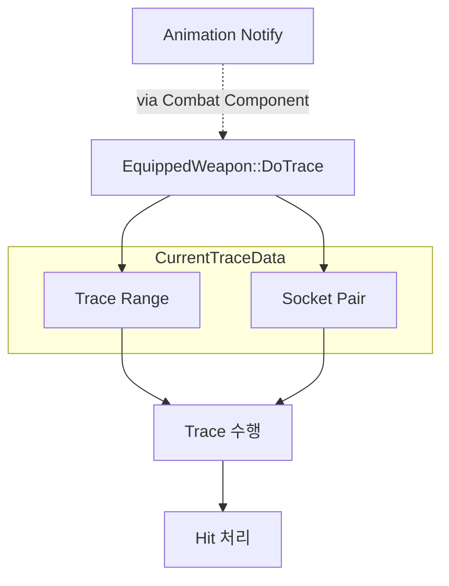

# Data-driven Trace System

> 공격 판정에 필요한 모든 설정을 Data Asset으로 분리한 구조입니다.

코드 수정 없이 새로운 공격을 추가하거나 판정 방식을 변경할 수 있습니다.

## 목차

* [설계 배경 및 결정](#설계-배경-및-결정)
* [구조 다이어그램](#구조-다이어그램)
* 핵심 구현
  * [Socket 기반 Trace](#Socket-기반-Trace)
    * [AnimNotify 기반 Socket 전환](#AnimNotify-기반-Socket-전환)
    * [Socket 조회 위치 결정](#Socket-조회-위치-결정)
* [트레이드오프 및 한계](#트레이드오프-및-한계)
* [관련 코드](#관련-코드)

---

## 설계 배경 및 결정

공격마다 판정 범위, 판정 위치와 같은 설정이 필요합니다. 초기에는 이를 코드에서 직접 관리했고 공격이 추가될 때마다 판정 로직도 함께 수정해야 했습니다.

판정 로직이 공격 데이터에 의존하는 구조라고 판단했기 때문에 공격 설정을 Data Asset으로 분리하고 파이프라인은 데이터를 읽어 실행만 담당하도록 구성하였습니다.

---

## 구조 다이어그램

AnimNotify를 통해 Trace 활성 구간을 제어하며 활성화된 동안 현재 Trace Data를 기반으로 판정이 수행됩니다.



---

## 핵심 구현


| 항목                 | 역할                     |
| ------------------ | ---------------------- |
| Key (Gameplay Tag) | 공격에 대응되는 Trace Data 식별 |
| Shape              | 공격에 사용할 Trace 방식       |
| Steps              | 공격 단계별 Socket Pair 정보  |
| Start Socket       | 판정 구간의 시작 위치           |
| End Socket         | 판정 구간의 종료 위치           |


Trace Data는 `GameplayTag`를 Key로 관리합니다.  
공격이 발생하면 현재 공격 Tag를 기준으로 `AttackSet`에서 대응되는 Trace Data를 조회합니다.

Attack Tag는 Map 조회 이후에도 현재 Trace Data가 어떤 공격에 속한 데이터인지 참조해야 하는 경우를 위해 별도로 보관합니다.
Map의 Key를 다시 역추적하지 않고 Data 내부에서 공격 정보를 사용할 수 있도록 둔 값입니다.

---

## Socket 기반 Trace

Trace 위치를 데이터로 관리합니다.

#### 문제

기존 구조는 Weapon Actor 내부에서 Scene Component를 두고 해당 위치를 직접 참조하는 방식이었습니다.

```cpp
const FVector Start = BoxTraceStart->GetComponentLocation();
const FVector End = BoxTraceEnd->GetComponentLocation();
```

이 방식은 Sword 하나의 공격을 처리하기에는 충분했지만 공격마다 Trace 위치가 달라지는 상황에서는 한계가 발생했습니다.

특히 맨손 공격을 추가하면서 콤보 단계마다 왼손과 오른손을 번갈아 사용해야 했기 때문에 **Trace Point를 고정할 경우 대응하기 어려웠습니다.** 또한 맨손 공격은 별도 Mesh를 가진 무기가 아니라 더미 Weapon Actor로 처리되며, 실제 Trace 위치는 캐릭터 손 Socket을 기준으로 잡아야 했습니다.

#### 해결

왼손/오른손 공격은 공격 규칙 자체가 다른 것이 아니라 **판정 위치만 다른 동일한 맨손 공격**이라고 판단했습니다. 따라서 Dummy Actor를 추가로 만들기보다 공격 단계별 Socket 정보만 데이터로 교체하는 방식으로 구성했습니다.

Trace 위치를 Socket 이름 기반으로 변경하고 공격 단계별 Socket Pair를 Steps 배열로 관리하도록 설계하였습니다. 판정 위치 역시 공격 데이터의 일부라고 판단하여 Socket 정보를 Data Asset으로 분리하였습니다.

각 공격은 Step별 Socket Pair(공격 판정 시작/종료 위치)를 정의하며 Trace는 해당 정보를 조회하여 수행됩니다.

| Index | Start Socket | End Socket |
| :--- | :--- | :--- |
| `Steps[0]` | `hand_l_start` | `hand_l_end` |
| `Steps[1]` | `hand_r_start` | `hand_r_end` |

  
#### 결과

| Combo Step | Trace Index | Logic Path |
| :--- | :--- | :--- |
| **Combo 1타** | `Steps[0]` | Left Hand Trace |
| **Combo 2타** | `Steps[1]` | Right Hand Trace |

결과적으로 공격 위치는 코드가 아닌 **데이터에 의해 결정**됩니다.

- 판정 위치만 다른 공격을 별도 Weapon으로 분리하지 않음
- 하나의 UnarmedWeapon이 공통 Trace 설정 유지
- 공격 위치 추가 시 Step 데이터만 추가
- CombatComponent는 공격 위치를 알 필요 없이 동일하게 Trace 요청

---

### AnimNotify 기반 Socket 전환

콤보에 따른 Socket 전환은 AnimNotify를 통해 수행합니다.

Notify가 발생하면 `CurrentTraceIndex`가 변경되고, 다음 Tick부터 해당 Step의 Socket Pair를 사용하게 됩니다.

```cpp
// NotifyBegin
WeaponHolder->SwitchSocket(Index);

// NotifyEnd
WeaponHolder->ResetSocket();
```

Trace 실행 시마다 현재 Index를 기준으로 Data Asset의 Socket 정보를 다시 조회합니다.

```cpp
FVector AMeleeWeapon::GetTraceStart() const
{
    return GetTrace(
        CurrentTraceData->Steps[CurrentTraceIndex].StartSocket
    );
}

FVector AMeleeWeapon::GetTraceEnd() const
{
    return GetTrace(
        CurrentTraceData->Steps[CurrentTraceIndex].EndSocket
    );
}
```

#### 효과

- AnimNotify는 Step Index만 관리
- Socket 선택은 Trace 실행 시점에 결정
- 공격 단계가 증가해도 Socket 전환 코드 수정 불필요

---

### Socket 조회 위치 결정

#### 문제

무기 공격과 맨손 공격은 같은 Trace Pipeline을 사용하지만 Socket을 가져오는 위치는 다릅니다. 일반 무기는 Weapon Mesh가 존재해 Socket을 읽을 수 있지만 Unarmed(맨손 공격)는 **Weapon Mesh가 없는 Dummy Actor**입니다. 그렇기 때문에 동일한 Socket 조회 방식을 사용할 수 없습니다.

#### 해결

Socket 이름은 동일하게 관리하면서 실제 Socket 위치는 공격 타입에 맞는 Mesh에서 조회하도록 구성했습니다.

```cpp
void AWeapon::ApplySocketPolicy()
{
	if (WeaponType == EWeaponType::EWT_Unarmed)
	{
		SetbUseCharacterSocket(true);
	}
	else
	{
		SetbUseCharacterSocket(false);
	}
}
```

```cpp
FVector AMeleeWeapon::GetTrace(FName SocketName) const
{
    USceneComponent* Mesh = ItemMesh;

    if (ICombatInterface* CombatInterface =
        Cast<ICombatInterface>(GetOwner()))
    {
        if (bUseCharacterSocket &&
            CombatInterface->GetCombatMesh())
        {
            Mesh = CombatInterface->GetCombatMesh();
        }
    }

    return Mesh
        ? Mesh->GetSocketLocation(SocketName)
        : GetActorLocation();
}
```

#### 결과

- 맨손 공격과 무기 공격 모두 동일한 Trace Pipeline 공유
- 공격 타입에 따라 Socket 조회 대상만 자동 전환

---

## 트레이드오프 및 한계

### 시각적 피드백 감소

Collision Component를 사용하던 기존처럼 에디터에서 직접 확인하며 크기를 조정하는 방식은 사용할 수 없게 되었습니다.

현재는 DrawDebug 계열 기능을 활용하여 실제 Trace가 수행되는 범위를 확인하면서 값을 조정하고 있습니다.

---

### Socket Name 검증 부재

Socket 이름은 문자열 기반으로 관리되기 때문에 컴파일 단계에서 검증되지 않습니다.

현재는 디버그 드로우를 통해 실제 Trace 위치를 확인하며 검증하고 있습니다.


## 관련 코드

### Trace 실행
- [Combat Data Asset](https://github.com/yeunseo0517-del/ActionCombat/blob/4a1dced90eb020acede0b37ffd3e9ed2e8f3a9e3/Source/ActionCombact/Public/Items/Weapons/Data/CombatDataAsset.h)

- [AMeleeWeapon::DoTrace()](https://github.com/yeunseo0517-del/ActionCombat/blob/4a1dced90eb020acede0b37ffd3e9ed2e8f3a9e3/Source/ActionCombact/Private/Items/Weapons/MeleeWeapon.cpp#L23)

- [AMeleeWeapon::GetTrace()](https://github.com/yeunseo0517-del/ActionCombat/blob/4a1dced90eb020acede0b37ffd3e9ed2e8f3a9e3/Source/ActionCombact/Private/Items/Weapons/MeleeWeapon.cpp#L158)

### AnimNotify 기반 Socket 전환
- [UANS_SwitchSocket::NotifyBegin()](https://github.com/yeunseo0517-del/ActionCombat/blob/4a1dced90eb020acede0b37ffd3e9ed2e8f3a9e3/Source/ActionCombact/Private/Animation/Notifies/Combat/ANS_SwitchSocket.cpp)

- [ABaseCharacter::SwitchSccket()](https://github.com/yeunseo0517-del/ActionCombat/blob/4a1dced90eb020acede0b37ffd3e9ed2e8f3a9e3/Source/ActionCombact/Private/Characters/BaseCharacter.cpp#L247)
  
- [AMeleeWeapon::SetTraceIndex()](https://github.com/yeunseo0517-del/ActionCombat/blob/4a1dced90eb020acede0b37ffd3e9ed2e8f3a9e3/Source/ActionCombact/Public/Items/Weapons/MeleeWeapon.h#L52)

### Socket 조회 위치 결정

- [ABaseCharacter::SwitchToWeapon()](https://github.com/yeunseo0517-del/ActionCombat/blob/4a1dced90eb020acede0b37ffd3e9ed2e8f3a9e3/Source/ActionCombact/Private/Characters/BaseCharacter.cpp#L83)

- [AWeapon::ApplySocketPolicy()](https://github.com/yeunseo0517-del/ActionCombat/blob/4a1dced90eb020acede0b37ffd3e9ed2e8f3a9e3/Source/ActionCombact/Private/Items/Weapons/Weapon.cpp#L94)


- [AMeleeWeapon::GetTrace()](https://github.com/yeunseo0517-del/ActionCombat/blob/4a1dced90eb020acede0b37ffd3e9ed2e8f3a9e3/Source/ActionCombact/Private/Items/Weapons/MeleeWeapon.cpp#L158)
