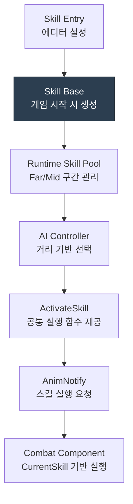

# Runtime-based Skill System

> 기획 변경이 AI 로직에 영향을 주지 않는 Runtime Skill 구조

## 목차

* [설계 배경](#설계-배경)
* [구조 다이어그램](#구조-다이어그램)
* [핵심 구현](#핵심-구현)
  * [Skill Entry와 Skill Base 분리](#skill-entry와-skill-base-분리)
  * [Skill Base](#skill-base)
  * [보스 AI의 Runtime Skill Pool](#보스-ai의-runtime-skill-pool)
  * [AnimNotify 기반 실행 타이밍 분리](#animnotify-기반-실행-타이밍-분리)
* [트레이드오프 및 한계](#트레이드오프-및-한계)
* [관련 코드](#관련-코드)

---

## 설계 배경

보스는 플레이어와의 거리에 따라 사용하는 스킬 조합이 달라집니다.

초기에는 AI가 거리 판단, 스킬 선택, 실행 함수 호출을 모두 처리했습니다. 스킬이 추가될수록 AI 안에 분기가 생겼고 기획이 여러 번 바뀌면서 AI 코드도 함께 수정해야 했습니다. **스킬 변경이 곧 AI 변경인 구조였습니다.**

문제는 AI가 스킬 내부 동작과 실행 타이밍까지 알고 있어야 한다는 점이었습니다. 

| 역할 | 담당 |
| :--- | :--- |
| 선택 | `AI Controller` |
| 타이밍 | `AnimNotify` |
| 실행 | `Combat Component` |

따라서 역할을 세가지로 나눴습니다.

AI가 아는 범위를 **지금 거리에서 쓸 수 있는 스킬 중 하나를 고르는 것**으로 제한했습니다. 선택한 스킬이 내부적으로 어떻게 동작하는지, 언제 실제 공격이 발생하는지는 알 필요가 없습니다.

---

## 구조 다이어그램



---

## 핵심 구현

## Skill Entry와 Skill Base 분리

#### 문제

스킬 데이터를 캐릭터 클래스 내부에서 직접 관리할 경우, 스킬 추가마다 설정값, 실행 함수, 선택 분기가 함께 늘어나 캐릭터 클래스가 비대해지는 문제가 있었습니다.

```cpp
if (Distance > Far)
{
    if (!bFireballCooldown)
        UseFireball();
    else if (!bWaveCooldown)
        UseWave();
}
else
{
    if (!bDashCooldown)
        UseDash();
    else if (!bSlashCooldown)
        UseSlash();
}
```

#### 해결

스킬 데이터는 에디터에서 설정하는 `FSkillEntry`에, 실행은 게임 시작 시 생성되는 `USKillBase` 인스턴스로 분리했습니다. 생성 이후 실행 경로에서는 항상 Skill Base을 참조합니다.

**Skill Entry**는 스킬 클래스, 거리 구간, 기본 **설정값을 담는 정적 데이터**이고, **Skill Base**는 실제 전투 중 선택되고 실행되는 Runtime Skill **객체**입니다.

```cpp
// 게임 시작 시 Entry → Runtime Skill 변환
USkillBase* RuntimeSkill = NewObject<USkillBase>(this, Entry.SkillClass);
RuntimeSkill->Init(Entry, int32(Slot), SkillCount);
```

#### 결과

- 스킬 설정을 코드가 아닌 데이터로 관리
- 스킬 추가 시 데이터 등록만으로 선택 후보 확장

---

## Skill Base

#### 문제

어떤 스킬은 즉시 버프를 적용하고 어떤 스킬은 애니메이션 이후 판정을 발생시키는 등 스킬마다 실행 절차가 서로 달랐습니다. 이를 `Character`나 `CombatComponent`에서 직접 처리할 경우, 스킬별 분기와 실행 코드가 계속 누적되는 구조였습니다.

또한 애니메이션 이후 판정을 발생시키는 스킬의 경우, 애니메이션 재생 후 AnimNotify 시점에 `CombatComponent`에서 처리됩니다. 선택 시점과 실행 시점이 분리되어 있기 때문에 실행 시점에 `CombatComponent`가 현재 선택된 스킬이 무엇인지 다시 판단하고, 해당 스킬 데이터에서 필요한 값을 해석해야 하는 구조가 됐습니다.

하지만 `CombatComponent`를 선택된 스킬을 실행하는 등 **전투 로직을 수행하는 주체로만** 두려는 설계 방향과 맞지 않았습니다.

#### 해결

스킬별 실행 정보와 해석 책임을 Skill Base로 분리했습니다. `CombatComponent`를 포함한 외부 시스템은 어떤 스킬인지, 스킬의 세부 동작을 알 필요 없이 ActivateSkill() 하나만 호출하면 됩니다.

```cpp
virtual void ActivateSkill(AActor* Owner) PURE_VIRTUAL(...);
```

`ActivateSkill()` 내부에서는 쿨다운 확인, 쿨다운 시작, 실행, 상태 부여 등 실행 절차를 자식 클래스가 순서대로 처리합니다. 새 스킬을 추가할 때 Skill Base를 상속받아 ActivateSkill()만 구현하면 기존 파이프라인에 그대로 연결됩니다.

```cpp
void URadialShockwave::ActivateSkill(AActor* Owner)
{
    // 쿨다운 확인 및 시작
    if (StatusComp->IsSkillOnCooldown(SkillID)) return;
    StartCoolDown(Owner);
    // 실행
    CombatInterface->GetCombatComponent()->ExecuteAttack(AttackTag);
    // 상태 부여
    StatusComp->AddStatus(EStatusType::EST_SuperArmor);
}
```

#### 결과

- 스킬 추가 시 수정 범위를 `CombatComponent`, 공격 주체, AI 로직에서 개별 Skill Base로 제한
- 기존 실행 파이프라인 수정 없이 새 스킬 확장 가능

---

## 보스 AI의 Runtime Skill Pool

#### 문제

보스 AI는 플레이어 입력을 대신해 **현재 거리에서 어떤 스킬을 사용할지 결정**하는 역할을 담당합니다.

하지만 전투 중 AI가 `SkillClass`를 직접 해석해 스킬을 생성하고 초기화하면 AI가 단순 선택을 넘어 스킬 실행 준비까지 책임지는 구조가 됩니다. 이 경우 AI가 어떤 스킬을 고를지뿐 아니라, 해당 스킬이 어떤 실행 정보를 가져야 하는지까지 알아야 하므로 선택 책임과 실행 책임이 섞이게 됩니다.

결과적으로 스킬 선택은 AI가 담당하고, 실행은 Combat Component가 담당한다는 역할 경계가 흐려집니다.

#### 해결 - 거리 기반 Runtime Skill Pool

| 거리 구분 | 스킬 목록 |
| :--- | :--- |
| Far (원거리) | Dash, Shockwave |
| Mid (중거리) | Fireball, Ground Slam |
| Close (근거리) | 기본 공격 (Basic Attack) |

게임 시작 시 `SkillBase` 인스턴스를 거리 구간별 `RuntimeSkillPool`에 미리 등록했습니다. 이때 `SkillBase`가 전투 중 바로 선택 및 실행이 가능하도록 각 `SkillBase`에는 `SkillID`, `AttackTag`, 실행 데이터 등 전투 중 필요한 정보가 초기화됩니다.

전투 중 AI는 이미 초기화된 `SkillBase` 후보 중 하나를 선택만 하며 선택된 스킬은 `CurrentSKill`로 `CombatComponent`에 전달됩니다.

```cpp
if (Distance > FarRange)
{
	SelectedSkill = SelectSkill(ESkillRange::Far);
}
else
{
	SelectedSkill = SelectSkill(ESkillRange::Mid);
}
```

## AnimNotify 기반 실행 타이밍 분리

일부 스킬은 선택 직후 바로 판정되는 것이 아니라 공격 애니메이션의 특정 프레임에서 투사체 생성이나 충격파 판정이 발생해야 했습니다.

애니메이션 중 `AnimNotify`가 발생하면 `CombatComponent`가 현재 선택된 `CurrentSkill`을 참조해 실제 판정에 필요한 정보를 가져와 처리합니다.

```cpp
void UCombatComponent::OnAttackWindow()
{
    if (!CurrentSkill) return;
    CurHitContext = CurrentSkill->GetSkillHitContext();

    if (HasShockwave()) SpawnRadialShockwave();
    if (HasProjectile()) SpawnProjectile();
}
```

---

## 트레이드오프 및 한계

### 디버깅 경로 증가

선택 / 타이밍 / 실행이 분리된 만큼 문제 발생 시 어느 단계가 원인인지 추적하는 과정이 필요합니다.

---

## 관련 코드

### SkillEntry

- [FSkillEntry](https://github.com/yeunseo0517-del/ActionCombat/blob/851e006ecedbf0cdd0a683a8421f04d328361ff6/Source/ActionCombact/Public/Types/SkillTypes.h#L106)

### Skill 객체

- [SkillBase.h](https://github.com/yeunseo0517-del/ActionCombat/blob/main/Source/ActionCombact/Public/Components/Combat/Skill/SkillBase.h)

- [SkillBase.cpp](https://github.com/yeunseo0517-del/ActionCombat/blob/main/Source/ActionCombact/Private/Components/Combat/Skill/SkillBase.cpp)

- [URadialShockwave::ActivateSkill()](https://github.com/yeunseo0517-del/ActionCombat/blob/851e006ecedbf0cdd0a683a8421f04d328361ff6/Source/ActionCombact/Private/Components/Combat/Skill/RadialShockwave.cpp#L13)

### AI

- [BossEnemy.cpp](https://github.com/yeunseo0517-del/ActionCombat/blob/main/Source/ActionCombact/Private/Enemy/BossEnemy.cpp)

### AnimNotify 기반 실행 타이밍

- [UAN_SpawnProjectile::Notify()](https://github.com/yeunseo0517-del/ActionCombat/blob/851e006ecedbf0cdd0a683a8421f04d328361ff6/Source/ActionCombact/Private/Animation/Notifies/Combat/AN_SpawnProjectile.cpp#L8)

- [UCombatComponent::OnAttackWindow()](https://github.com/yeunseo0517-del/ActionCombat/blob/851e006ecedbf0cdd0a683a8421f04d328361ff6/Source/ActionCombact/Private/Components/Combat/CombatComponent.cpp#L186)
