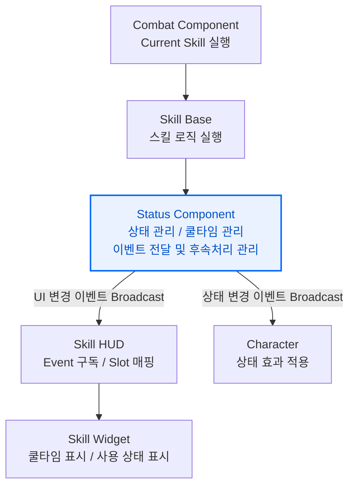

# 스킬 레이어 간 단방향 흐름

> HUD와 Character가 스킬을 직접 조회하지 않는 이벤트 기반 상태 전달 구조

## 목차

* [설계 배경](#설계-배경)
* [구조 다이어그램](#구조-다이어그램)
* 핵심 구현
  * [StatusComponent 기반 상태 관리](#StatusComponent-기반-상태-관리)
* [트레이드오프 및 한계](#트레이드오프-및-한계)
* [관련 코드](#관련-코드)

---

## 설계 배경

스킬이 실행되면 스킬 로직만 처리되는 것이 아니라 HUD 표시, Character 상태 효과, 쿨타임, 전투 계산까지 여러 레이어에 영향이 전달됩니다.

초기에는 스킬 실행 객체에서 필요한 대상을 직접 호출하는 방식도 고려했습니다. 예를 들어, 데미지 증가 스킬이 HUD 오버레이를 직접 제어하고, Character의 이펙트를 직접 실행하며, CombatComponent의 데미지 계산까지 직접 변경하는 방식입니다.

하지만 이 구조에서는 스킬이 자신보다 뒤에 있는 레이어의 구현 방식을 알아야 합니다.

| 대상 | 스킬이 알게 되는 정보 |
| :--- | :--- |
| HUD | 사용 중 오버레이, 쿨타임 오버레이, 슬롯 갱신 방식 |
| Character | 이펙트 실행 위치, 태그 처리 방식, Shield Component 활성화 방식 |
| CombatComponent | 데미지 증가 수치 적용 방식, 중첩 계산 방식 |

이렇게 되면 스킬 하나를 수정하거나 추가할 때마다 HUD, Character, CombatComponent의 구현까지 함께 확인해야 합니다.  
즉 스킬 실행 결과가 여러 레이어로 퍼지면서 **의존 방향이 복잡해지는 문제**가 있었습니다.

따라서 스킬이 각 시스템을 직접 제어하지 않고 스킬 실행 이후 필요한 상태 관리와 이벤트 발행 책임을 StatusComponent로 분리했습니다. 스킬은 상태와 수치만 등록하고 시스템은 각자 필요한 시점에 StatusComponent의 이벤트나 상태 값을 참조하도록 구성했습니다. 이 과정에서 델리게이트를 적극 활용했습니다.

이를 통해 **각 레이어는 자신보다 뒤에 있는 처리 대상의 구체적인 구현을 몰라도 됩니다.** 스킬은 상태만 등록하고 `HUD`/`Character`/`CombatComponent`는 각자 필요한 시점에 `StatusComponent`를 통해서만 정보를 받습니다.

| 역할 | 담당 |
| :--- | :--- |
| 스킬 실행 | SkillBase |
| 상태 / 쿨타임 / 이벤트 관리 | StatusComponent |
| UI 갱신 | SkillHUDWidget, SkillWidget |
| 캐릭터 효과 적용 | Character |

---

## 구조 다이어그램



---

## 핵심 구현

## StatusComponent 기반 상태 관리

`StatusComponent`는 스킬 사용 후 **발생하는 상태 변화를 중앙에서 관리**하는 역할입니다.

스킬 실행 결과를 `StatusComponent`에 등록합니다. StatusComponent는 등록된 정보를 기준으로 쿨타임을 저장하고, 스킬 이벤트를 발생시키며, 전투에 영향을 주는 상태 값을 관리합니다. 

현재 `StatusComponent`가 담당하는 처리는 크게 세 가지입니다.

| 처리 | 역할 |
| :--- | :--- |
| 쿨타임 관리 | SkillID를 기준으로 쿨타임 종료 시간 저장 |
| 스킬 이벤트 발행 | 스킬 활성화, 쿨타임 시작, 스킬 종료 이벤트 전달 |
| 상태 관리 | 강화, 무적 같은 상태와 수치 관리 |

```cpp
void UStatusComponent::ActivateSkill(int32 Slot, int32 SkillID, float Cooldown)
{
    OnSkillActivated.Broadcast(Slot);
    StartCooldown(Slot, SkillID, Cooldown);
}
```

---

### 쿨타임 관리

쿨타임은 스킬 자체의 상태이기 때문에 고유 `SkillID`를 기준으로 쿨타임 종료 시간`EndTime`을 `CooldownEndtime` Map에 저장합니다.

```cpp
void UStatusComponent::StartCooldown(int32 Slot, int32 SkillID, float Cooldown)
{
    float Now = GetWorld()->GetTimeSeconds();
    float EndTime = Now + Cooldown;

    CooldownEndTime.Add(SkillID, EndTime);
    OnCooldownStart.Broadcast(Slot, EndTime, Cooldown);
}
```

---

### 스킬 이벤트

`StatusComponent`는 스킬 실행 이후 필요한 이벤트를 관리합니다.

| 이벤트 | 발생 시점 | 연결 대상| 역할 |
| :--- | :--- | :--- | :--- |
| `OnStatusStart` | 상태 활성화 | Character| 상태별 이펙트, 태그, 쉴드 등 처리 |
| `OnStatusEnd` | 상태 완전히 종료 | Character| 상태별 효과 해제 |
| `OnCooldownStart` | 스킬 쿨타임 시작 | HUD| 해당 슬롯의 쿨타임 UI 표시 |
| `OnSkillActivated` | 스킬 활성화 | HUD| 해당 슬롯의 '사용 중' 오버레이 표시 |
| `OnSkillDeactivated` | 스킬 종료 | HUD| 해당 슬롯의 '사용 중' 오버레이 해제 |

#### Character로의 연결

스킬은 데미지 증가, 무적 같은 상태 효과를 `Character`에 직접 적용하지 않고 `StatusComponent`에 상태로 등록합니다.

```cpp
void UStatusComponent::AddStatus(EStatusType Status)
{
	int32& Count = StatusCount.FindOrAdd(Status);
	Count++;
	if (Count == 1)
	{
		OnStatusStart.Broadcast(Status);
	}
}
```

상태가 시작되면 `StatusComponent`는 `OnStatusStart` 이벤트를 발생시킵니다.

`Character`는 `OnStatusStart`를 통해 필요한 처리을 수행합니다. 예를 들어 데미지 강화 상태에서는 강화 이펙트를 실행하고 무적 상태에서는 무적 태그나 Shield Component를 활성화하는 방식입니다.

이렇게 분리하면 스킬 클래스가 Character의 이펙트 위치나 태그 처리 방식 등을 직접 알 필요가 없습니다.

#### HUD로의 연결

HUD는 `StatusComponent`의 스킬 이벤트를 구독하여 UI 상태를 갱신합니다.

Skill Widget은 '사용 중' 오버레이, '쿨타임' 오버레이, 기본 아이콘을 조합하여 현재 스킬 상태를 표시합니다. 각 오버레이의 표시 시점은 스킬 클래스가 직접 제어하지 않고, `StatusComponent`의 델리게이트 이벤트를 HUD가 구독하여 처리하도록 구성했습니다.

---

### 상태 관리

상태는 단순 bool이 아니라 Count 기반으로 관리합니다.

같은 상태가 여러 경로에서 중첩될 수 있기 때문에 상태가 처음 활성화될 때만 시작 이벤트를 발생시키고 모든 중첩이 사라졌을 때만 종료 이벤트를 발생시킵니다.

```cpp
void UStatusComponent::RemoveStatus(EStatusType Status)
{
	if (!StatusCount.Contains(Status)) return;

	int32& Count = StatusCount[Status];
	Count = FMath::Max(0, Count - 1);
	if (Count == 0)
	{
		OnStatusEnd.Broadcast(Status);
	}
}
```

---

## 트레이드오프 및 한계

### 디버깅 경로 증가

실행 흐름을 확인하려면 `Skill -> StatusComponent -> HUD / Character`로 이어지는 이벤트 전달 경로를 따라가야 합니다.

특히 HUD 표시 문제가 발생했을 때 스킬 클래스만 확인하는 것이 아니라, `StatusComponent`에서 이벤트가 정상적으로 Broadcast 되었는지, HUD가 해당 이벤트를 구독하고 있는지 함께 확인해야 합니다.

### 이벤트 호출 누락 가능성

지속 시간이 있는 스킬은 종료 시점에 `OnSkillDeactivated`가 발생하도록 명시적으로 종료 이벤트를 호출해야 합니다. 이 호출이 누락되면 실제 스킬 효과는 끝났더라도 HUD의 `사용 중` 오버레이가 해제되지 않을 수 있습니다.

현재 구조에서는 지속형 스킬의 종료 함수에서 `SkillDurationEnd`를 호출하도록 처리했습니다.

---

## 관련 코드

### Status Component
- [StatusComponent.h](https://github.com/yeunseo0517-del/ActionCombat/blob/main/Source/ActionCombact/Private/Components/Status/StatusComponent.cpp)
- [StatusComponent.cpp](https://github.com/yeunseo0517-del/ActionCombat/blob/main/Source/ActionCombact/Private/Components/Status/StatusComponent.cpp)

### Skill
- [USkillBase::StartCoolDown()](https://github.com/yeunseo0517-del/ActionCombat/blob/4ce91d7e94e1917d7b0c9b24e6491a656d037eaf/Source/ActionCombact/Private/Components/Combat/Skill/SkillBase.cpp#L9)
- [UEnhanceSkill::ActivateSkill()](https://github.com/yeunseo0517-del/ActionCombat/blob/4ce91d7e94e1917d7b0c9b24e6491a656d037eaf/Source/ActionCombact/Private/Components/Combat/Skill/EnhanceSkill.cpp#L8)

### HUD
- [SkillHUDWidget.cpp](https://github.com/yeunseo0517-del/ActionCombat/blob/main/Source/ActionCombact/Private/HUD/SkillHUDWidget.cpp)
- [SkillWidget.cpp](https://github.com/yeunseo0517-del/ActionCombat/blob/main/Source/ActionCombact/Private/HUD/SkillWidget.cpp)

### Character / Combat
- [ABaseCharacter::HandleStatusStart()](https://github.com/yeunseo0517-del/ActionCombat/blob/4ce91d7e94e1917d7b0c9b24e6491a656d037eaf/Source/ActionCombact/Private/Characters/BaseCharacter.cpp#L403)
- [UCombatComponent::CalculateDamage()](https://github.com/yeunseo0517-del/ActionCombat/blob/4ce91d7e94e1917d7b0c9b24e6491a656d037eaf/Source/ActionCombact/Private/Components/Combat/CombatComponent.cpp#L306)
