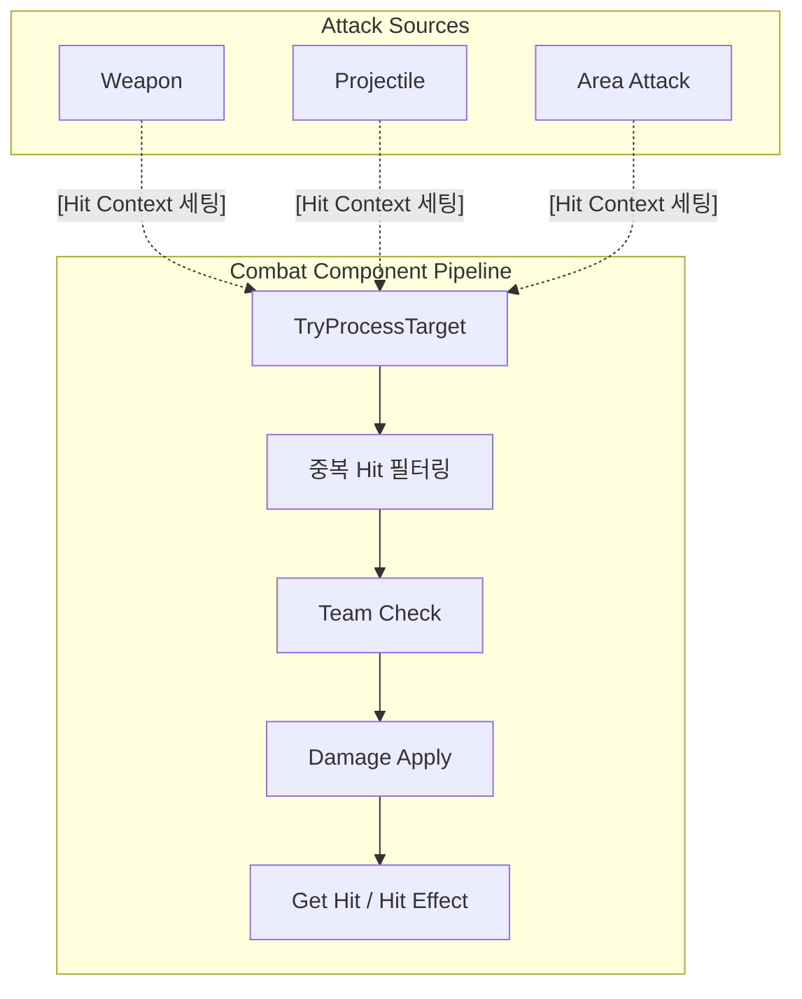

# Unified Hit Pipeline

> 공격 생성과 피격 처리를 분리한 통합 Hit Pipeline

## 목차

* [설계 배경 및 결정](#설계-배경-및-결정)
* [구조 다이어그램](#구조-다이어그램)
* 핵심 구현
  * [Hit Context](#Hit-Context)
  * [중복 Hit 필터링](#중복-Hit-필터링)
  * [Team Check](#Team-Check)
  * [Damage Apply](#Damage-Apply)
  * [Get Hit / Hit Effect](#Get-Hit/Hit-Effect)
* [트레이드오프 및 한계](#트레이드오프-및-한계)
* [관련 코드](#관련-코드)

---

## 설계 배경 및 결정

Weapon과 Area Attack에 피격 처리 로직이 각각 존재했습니다.

하지만 Projectile을 추가하면서 **팀 체크, 데미지 적용, 피격 반응** 로직이 세 곳에서 중복된다는 것을 발견했습니다. 공격 방식이 추가될 때마다 동일한 로직을 다시 구현해야 하는 구조였기 때문에 중복되는 피격 처리 로직을 통합했습니다.

피격 처리는 공격 주체가 하는 행위라고 생각했기 때문에 별도의 클래스 없이 이미 공격 로직을 담당하고 있던 **Combat Component에 통합했습니다.**

---

## 구조 다이어그램

각 공격 방식은 `CombatComponent`의 `TryProcessTarget()` 만 호출하면 됩니다. 이후 처리는 `CombatComponent`가 담당합니다.



---

## 핵심 구현

## Hit Context

공격 방식과 무관하게 동일한 피격 처리를 수행하기 위해 필요한 정보를 하나의 구조체로 묶었습니다. 공격이 시작될 때 `HitContext`를 세팅하고 피격 처리 모든 과정에서 이 구조체를 참조합니다.

| 필드 (Field) | 의미 | 상세 역할 |
| :--- | :--- | :--- |
| Instigator | 공격 주체 | 데미지의 근원 확인 |
| DamageCauser | 데미지 유발 Actor | Trace/Sweep을 수행한 Actor |
| AttackTag | 공격 식별 Tag | 공격 유형별 로직 분기 |
| Damage | 기본 데미지 | 피격 수치 데이터 |
| AlreadyHitActors | 피격 목록 | 중복 피격 방지 리스트 |

공격 방식마다 HitContext를 세팅하는 방식은 다르지만, 이후 파이프라인은 동일하게 동작합니다.

```cpp
// Weapon 공격 시
CurHitContext = BuildWeaponHitContext(AlreadyHit);

// Skill 사용 시
FHitContext HitContext = GetSkillHitContext()
```

---

## 중복 Hit 필터링

한 번의 공격에서 동일한 대상을 여러 번 처리하지 않도록 `AlreadyHitActors`로 필터링합니다.

```cpp
void UCombatComponent::TryProcessTarget(AActor* Target, FVector ImpactPoint)
{
    if (!Target) return;
    if (CurHitContext.AlreadyHitActors.Contains(Target)) return;
    HandleHitResult(Target, ImpactPoint);
    CurHitContext.AlreadyHitActors.Add(Target);
}
```

---

## Team Check

`ITeamInterface`를 통해 팀 타입을 비교합니다. 인터페이스 기반이라 팀 로직을 가진 Actor라면 공격 방식과 무관하게 동일하게 처리됩니다.

```cpp
bool UCombatComponent::IsHostile(AActor* OtherActor)
{
    if (ITeamInterface* Hitter = Cast<ITeamInterface>(CurHitContext.Instigator))
    {
        if (ITeamInterface* Other = Cast<ITeamInterface>(OtherActor))
        {
            return Hitter->GetTeamType() != Other->GetTeamType();
        }
    }
    return false;
}
```

---

## Damage Apply

기본 데미지는 HitContext에 저장되어 있고 추가 데미지는 StatusComponent에서 관리합니다.

스킬 사용 중 강화 효과가 적용될 수 있기 때문에 `CombatComponent`는 데미지를 계산할 때마다 HitContext의 기본 데미지에 `StatusComponent`의 추가 데미지를 더해 최종 데미지를 계산합니다.

```cpp
float UCombatComponent::CalculateDamage(float DefaultDamage)
{
    float Damage = DefaultDamage;
    if (IStatusReceiverInterface* Receiver = Cast<IStatusReceiverInterface>(GetOwner()))
    {
        UStatusComponent* StatusComp = Receiver->GetStatusComponent();
        if (StatusComp)
            Damage += StatusComp->GetEnhancedDamage();
    }
    return Damage;
}
```

---

## Get Hit / Hit Effect

데미지 적용 성공 시 `IHitInterface`를 통해 피격 반응을 호출하고 이펙트를 생성합니다.

```cpp
void UCombatComponent::HandleHitResult(AActor* HitActor, FVector ImpactPoint)
{
    if (!HitActor) return;
    if (ProcessDamageApplication(HitActor))
    {
        ExecuteGetHit(HitActor, ImpactPoint);
        SpawnHitSparkParticles(ImpactPoint);
    }
}
```

피격 반응(GetHit)과 이펙트(SpawnHitSparkParticles)가 데미지 적용 성공 여부에 따라 실행됩니다. 이전 단계를 통과하지 못하면 이펙트도 생성되지 않습니다.

---

## 트레이드오프 및 한계

### 공격 방식별 예외 처리 비용 증가

모든 공격이 동일한 파이프라인을 통과하기 때문에 특정 공격에서만 다른 피격 처리가 필요할 경우 HitContext에 조건을 추가하거나 파이프라인을 분기해야 합니다.

---

## 관련 코드

### Hit Pipeline

- [HitContext.h](https://github.com/yeunseo0517-del/ActionCombat/blob/main/Source/ActionCombact/Public/Types/HitContext.h)

- [UCombatComponent::TryProcessTarget()](https://github.com/yeunseo0517-del/ActionCombat/blob/7f00e6764a3b4784d176d9216d999511b36b736d/Source/ActionCombact/Private/Components/Combat/CombatComponent.cpp#L320)

- [UCombatComponent::IsHostile()](https://github.com/yeunseo0517-del/ActionCombat/blob/7f00e6764a3b4784d176d9216d999511b36b736d/Source/ActionCombact/Private/Components/Combat/CombatComponent.cpp#L364)

- [UCombatComponent::ProcessDamageApplication()](https://github.com/yeunseo0517-del/ActionCombat/blob/7f00e6764a3b4784d176d9216d999511b36b736d/Source/ActionCombact/Private/Components/Combat/CombatComponent.cpp#L338)

### 공격 방식별 진입점

- [AMeleeWeapon::ProcessOverlapResults()](https://github.com/yeunseo0517-del/ActionCombat/blob/7f00e6764a3b4784d176d9216d999511b36b736d/Source/ActionCombact/Private/Items/Weapons/MeleeWeapon.cpp#L57)

- [ARadialShockwaves::ProcessHitResults()](https://github.com/yeunseo0517-del/ActionCombat/blob/7f00e6764a3b4784d176d9216d999511b36b736d/Source/ActionCombact/Private/Components/Combat/AreaEffects/RadialShockwaves.cpp#L106)

- [ALinearWaveProjectile::ProcessHitResults()](https://github.com/yeunseo0517-del/ActionCombat/blob/7f00e6764a3b4784d176d9216d999511b36b736d/Source/ActionCombact/Private/Components/Combat/Projectiles/LinearWaveProjectile.cpp#L63)
