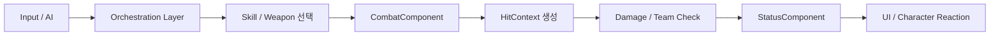
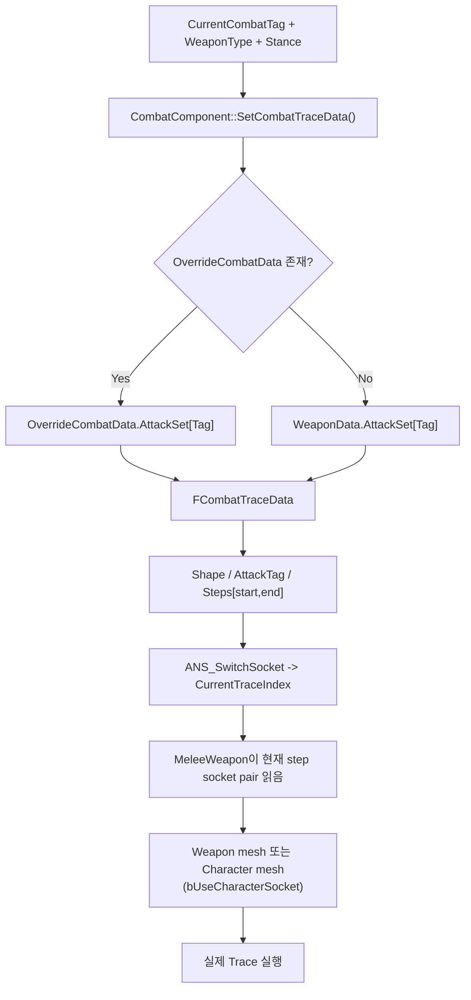

UE5 C++ 기반 액션 전투 프로토타입

플레이어, 일반 적, 보스가 서로 다른 방식으로 행동하지만  
동일한 전투/피해 처리 파이프라인을 공유하도록 설계된 구조입니다.

전투는 입력/AI → 스킬/공격 생성 → 판정 → 상태/표현으로 분리되어 있으며  
데이터 교체만으로 전투 스타일이 변경되도록 설계했습니다.

---

# 핵심 설계 포인트

1. Runtime Skill 구조 (Player / Boss 오케스트레이션 분리)
2. Data-driven Trace 기반 공격 판정 시스템
3. 통합 Combat Processing Pipeline
4. StatusComponent 기반 상태/쿨다운/UI 분리

---

## 1. Runtime Skill Composition (Player vs Boss)

플레이어와 보스는 스킬 생성 방식이 다르지만  
최종 실행 구조는 동일합니다.

### Player
Weapon → SkillEntries → Runtime Skill 생성

### Boss
SkillPool → AI 선택 로직 → Runtime Skill 생성

```cpp
USkillBase::ActivateSkill(Owner);
```



캐릭터나 무기는 구체적인 전투 로직을 내장하지 않고, 런타임에 적절한 스킬을 조립하고 선택하는 'Selection Layer' 역할만 수행합니다.


### 핵심 설계 의도
- 관심사 분리
  전투 로직은 캐릭터 본체가 아닌 Skill Class에 고립시켜 캐릭터 코드의 비대화를 방지합니다.
- Interface 기반 추상화
  호출자는 실행될 스킬의 세부 구현을 알 필요가 없습니다.
- 높은 재사용성
  Player, Boss, Minion 등 모두가 동일한 실행 구조를 공유하므로, 새로운 타입의 캐릭터를 추가하더라도 전투 시스템을 수정 없이 재사용할 수 있습니다.

```cpp
Input / AI / Weapon
        ↓
   Skill Selection
        ↓
   USkillBase::Activate()
        ↓
 Combat Execution Trigger
```

---

## 2. Data-driven Trace System
공격 판정은 코드가 아니라 데이터로 정의됩니다.

- Steps 기반 Socket Pair 구조
- ANS가 Index만 변경
- WeaponData / OverrideData 지원




각 공격 Step은 다음 정보를 포함합니다:

- Start / End socket pair (또는 단일 socket)
- Character mesh / Weapon mesh source 선택
- Trace 방식(Box / Sphere / Sweep)

애니메이션 Notify State(ANS_SwitchSocket)를 통해
현재 콤보 Step index를 갱신하고, 해당 Step의 TraceData로 자동 전환됩니다.

Unarmed 및 모든 근접 공격을 단일 Weapon 파이프라인으로 통합하고,
공격 콤보는 Trace Step 단위로 정의된 socket sampling 규칙을 교체하는 방식으로 처리했습니다.

콤보 진행에 따라 Trace Step이 변경되며,
각 Step은 Left/Right Punch에 해당하는 socket pair를 교체하는 방식으로 구성됩니다.

이를 통해:

- 좌/우 주먹 공격을 별도 무기 없이 처리
- 무기 시스템과 동일한 Trace pipeline 재사용
- 콤보 확장을 데이터 기반으로 처리

## 결과
- Socket 개수/구조 변화가 코드 수정 없이 데이터로 해결됨
- 콤보 확장 시 Weapon Class 변경 필요 없음
